# 🏷️ Zenity ile Basit Envanter Yönetim Sistemi

Bu proje, **Zenity** araçlarını kullanarak geliştirilen kullanıcı dostu bir **Envanter Yönetim Sistemi**dir. **Linux Bash betiği** kullanılarak oluşturulmuş olup, **grafik arayüz** ile kolayca ürün ekleme, güncelleme, silme ve listeleme işlemleri yapılabilir.  
Ek olarak, **kullanıcı yönetimi**, **stok raporları** ve **hata loglama** gibi ek özellikler içerir.  

## 📥 **Kurulum & Çalıştırma**
**Adım 1:** **Zenity**'yi yükleyin (eğer sisteminizde yoksa):  

 sudo apt install zenity

---

## 🚀 **Özellikler**
✔ **Kullanıcı Rolleri** (Yönetici & Kullanıcı)  
✔ **Ürün Yönetimi** (Ekleme, Listeleme, Güncelleme, Silme)  
✔ **Raporlama** (Azalan Stoklar & En Yüksek Stok)  
✔ **Kullanıcı Yönetimi** (Yeni kullanıcı ekleme, düzenleme ve silme)  
✔ **Şifre Yönetimi** (Şifre sıfırlama ve hesap kilitleme)  
✔ **Hata Yönetimi** (Hata kayıtları, log dosyası)  
✔ **Disk Yönetimi** (Depo yedekleme ve disk alanı kontrolü)  

---
🎯 Nasıl Kullanılır?

📌 1. Giriş Ekranı:İlk olarak kullanıcı adı ve şifre girerek giriş yapabilirsiniz.

  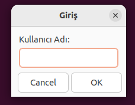    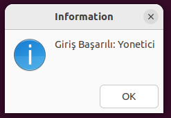

📌 Yönetici: Ürün ekleme, güncelleme ve kullanıcı yönetimi yapabilir.
 

📌 Kullanıcı: Sadece ürünleri listeleyebilir ve rapor alabilir.

  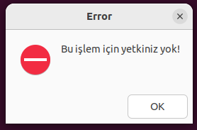

📌Kullanıcının şifreyi doğru girmek için 3 hakkı bulunmaktadır.Eğer şifre 3 defa hatalı girilirse hesap kilitlenir.Kilitli hesabı sadece yönetici, hesabı aç kısmından tekrar aktive edebilir.

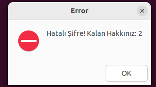           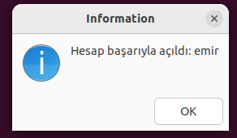              

  
 
---

📌 2. Ana Menü
Kullanıcı yetkisine bağlı olarak aşağıdaki menü seçenekleri görüntülenir.

 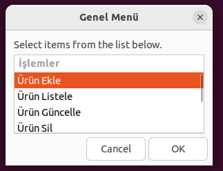    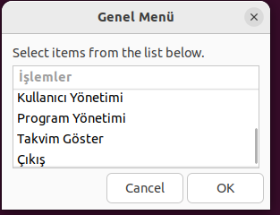 

🔹 Ürün Ekle

🔹 Ürün Listele

🔹 Ürün Güncelle

🔹 Ürün Sil

🔹 Rapor Al

🔹 Kullanıcı Yönetimi

🔹 Program Yönetimi

🔹 Takvim Göster : Bu seçenek envanter sisteminde tarihlerin önemli olduğu için eklenmiştir.

---

📌 3. Ürün Ekleme

Ürün bilgilerini girerek envantere yeni bir ürün ekleyebilirsiniz.

 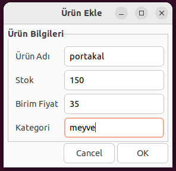   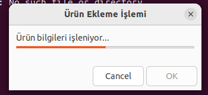 

🔹 Ürün Adı

🔹 Stok Miktarı

🔹 Birim Fiyatı

👉 Zenity Forms arayüzü ile kolay kullanım sağlanmaktadır.

---

📌 4. Ürün Listeleme

Kayıtlı ürünleri görüntülemek için "Ürün Listele" seçeneği kullanılır.

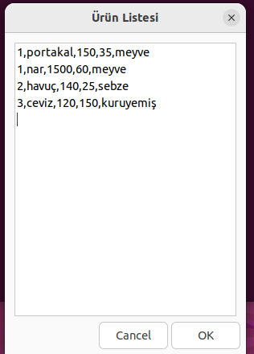

📌 Özellikler:

✔ CSV dosyasından okunan veriler Zenity --text-info ile gösterilir.
✔ Arama ve filtreleme seçenekleri.
   
📌 5. Ürün Güncelleme

Bir ürünün stok miktarı veya fiyatını değiştirmek için "Ürün Güncelle" seçeneği kullanılır.

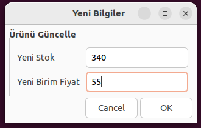

🔹 Güncellenecek ürünün adı girilir.

🔹 Yeni stok veya fiyat bilgisi girilir.

---

📌 6. Ürün Silme
Ürün silme işlemi için kullanıcıdan onay alınır ve ardından işlem tamamlanır.

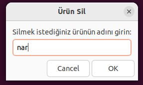

✔ Zenity --question ile silme onayı alınır.

✔ İşlem log.csv dosyasına kaydedilir.

---
📌 7. Rapor Alma

Sistem, stok seviyelerini analiz ederek raporlama sunar.

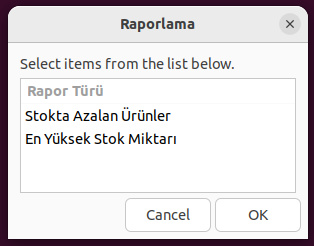

🔹 Stokta Azalan Ürünler

🔹 En Yüksek Stok Miktarına Sahip Ürünler

---
📌 8. Kullanıcı Yönetimi

📌 Yalnızca Yönetici tarafından erişilebilir.

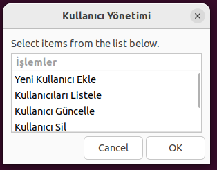

✔ Yeni kullanıcı ekleme

✔ Kullanıcı listeleme

✔ Kullanıcı güncelleme

✔ Kullanıcı silme

---

⚙ Geliştirme Süreci

Bu proje, Bash Scripting ve Zenity GUI entegrasyonu ile geliştirilmiştir.

📌 Kullanılan Komutlar: awk, grep, chmod, df, touch, cp, mv

📌 Veri depolama formatı: CSV dosyaları (depo.csv, kullanici.csv, log.csv)

---
🎥 Demo Videosu

📌 Projenin nasıl çalıştığını görmek için aşağıdaki bağlantıya tıklayın:

🎥 Demo Videosunu İzle

---
🛠️ Sistem Gereksinimleri

✅ Linux Dağıtımı: Ubuntu, Debian, Arch, Fedora

✅ Gereksinimler: Bash, Zenity, CSV işlem desteği

📞 İletişim
📌 Geliştirici: [ceydagulen]
📌 E-posta: [ceyda_glnn_@hotmail.com]
📌 GitHub: [github.com/kullaniciadi]
