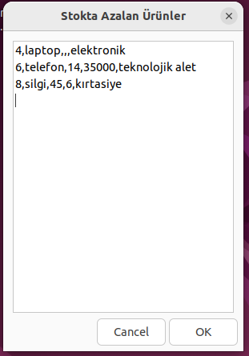
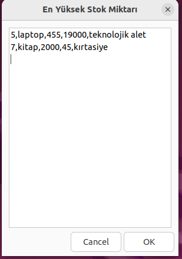
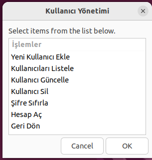
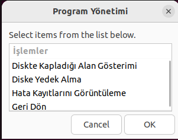
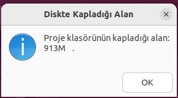
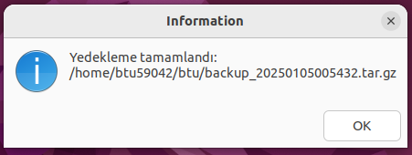
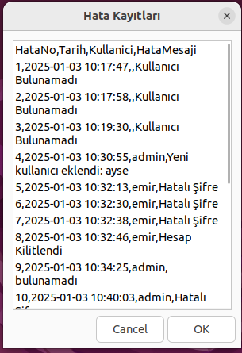
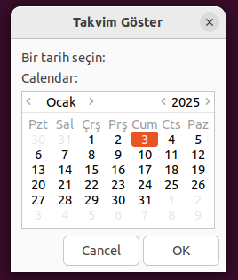

# **Zenity ile Basit Envanter Yönetim Sistemi**

Bu proje, Zenity ve Bash kullanılarak geliştirilen kullanıcı dostu bir Envanter Yönetim Sistemidir. Grafik arayüzü sayesinde kolayca ürün ekleme, güncelleme, silme ve listeleme işlemleri yapılabilir.

Ek olarak, sistem kullanıcı yönetimi, stok raporlama, hata loglama ve otomatik yedekleme gibi ek özellikler sunmaktadır.

**Tanıtım Videosu** : https://www.youtube.com/watch?v=1NJlFgJ7CVE
 

📌 **Özellikler**

  Grafik Arayüz: Zenity kullanarak sezgisel kullanıcı deneyimi

 Ürün Yönetimi: Ürün ekleme, güncelleme ve silme işlemleri

 Stok Takibi: Mevcut ürünleri görüntüleme ve raporlama

 Kullanıcı Yönetimi: Yetkilendirme ve giriş kontrolü

 Hata Loglama: Hataların ve işlem kayıtlarının tutulması

 Otomatik Yedekleme: Veriler .tar.gz formatında sıkıştırılarak saklanır

 

📌 **Kullanılan Teknolojiler**

Programlama Dili: Bash

Grafik Arayüz: Zenity

Veri Depolama: CSV dosyaları (depo.csv, kullanici.csv, log.csv)

Yedekleme Formatı: .tar.gz sıkıştırılmış arşivler (backup_YYYYMMDD.tar.gz)

Temel Komutlar: awk, grep, chmod, df, touch, cp, mv,tar

📌 **Sistem Gereksinimleri**

 İşletim Sistemi: Linux (Ubuntu önerilir)
 
 Bağımlılıklar: Bash, Zenity

## 📥  **Kurulum**
 **Zenity**'yi yükleyin (eğer sisteminizde yoksa):  

 sudo apt install zenity

 ##  **Programı Başlatın**
 Projeyi indirdikten sonra gerekli yetkileri verip ardından programı başlatın.
 
**./envanter_uygulamasi.sh**

---

**1. Giriş Ekranı**

İlk olarak kullanıcı adı ve şifre girerek giriş yapabilirsiniz.

      

Yönetici: Ürün ekleme, güncelleme ve kullanıcı yönetimi yapabilir.
 

 Kullanıcı: Sadece ürünleri listeleyebilir ve rapor alabilir.

  

Kullanıcının şifreyi doğru girmek için 3 hakkı bulunmaktadır.Eğer şifre 3 defa hatalı girilirse hesap kilitlenir.Kilitli hesabı sadece yönetici, hesabı aç kısmından tekrar aktive edebilir.

                         

  
 
---

 **2. Ana Menü**
 
Kullanıcı yetkisine bağlı olarak aşağıdaki menü seçenekleri görüntülenir.

      

🔹 Ürün Ekle

🔹 Ürün Listele

🔹 Ürün Güncelle

🔹 Ürün Sil

🔹 Rapor Al

🔹 Kullanıcı Yönetimi

🔹 Program Yönetimi

🔹 Takvim Göster : Bu seçenek envanter sisteminde tarihlerin önemli olduğu için eklenmiştir.

---

**3. Ürün Ekleme**

Ürün bilgilerini girerek envantere yeni bir ürün ekleyebilirsiniz.

     

🔹Ürün adı, stok miktarı, fiyat ve kategori bilgileri girilir.

🔹Aynı isimde ancak farklı kategorilerde ürün eklenebilir.

🔹 Zenity Forms arayüzü ile kolay kullanım sağlanmaktadır.

---

**4. Ürün Listeleme**

Kayıtlı ürünleri görüntülemek için "Ürün Listele" seçeneği kullanılır.

🔹 CSV dosyasından okunan veriler Zenity --text-info ile gösterilir.

🔹 Ürün numarası, adı, stok miktarı, fiyat ve kategori bilgileri görüntülenir

---

**5. Ürün Güncelleme**

Bir ürünün stok miktarı veya fiyatını değiştirmek için "Ürün Güncelle" seçeneği kullanılır.

🔹Güncelleme işlemi için öncelikle ürün adı girilir, ardından listeden doğru ürün seçilir.

🔹Sistem, güncelleme işlemi öncesinde eski ve yeni bilgileri log kayıtlarına ekler.

🔹Aynı isimde farklı kategoride bulunan ürünler için kategori seçimi yapılabilir.

---

**6. Ürün Silme**

Ürün silme işlemi için kullanıcıdan onay alınır ve ardından işlem tamamlanır.

 🔹Silinen ürünlerin bilgileri hata_kaydi.csv dosyasına kaydedilir.
 
 

---
**7. Rapor Alma**

Sistem, stok seviyelerini analiz ederek raporlama sunar.

🔹Stokta Azalan Ürünler

🔹En Yüksek Stok Miktarına Sahip Ürünler

---
**8. Kullanıcı Yönetimi**

 Yalnızca Yönetici tarafından erişilebilir.

🔹Yeni kullanıcı ekleme, mevcut kullanıcıları listeleme, güncelleme, silme işlemleri  ve kilitli olan hesabı açma işlemleri yapılabilir.

🔹Şifre yönetimi ve kullanıcı rollerinin düzenlenmesi mümkündür.Ayrıca kullanıcı şifresini çok deneyerek hesabını kilitlemişse yönetici hesap aç 
kısmından hesabı tekrardan aktive edebilir.

---

**9.Program Yönetimi**

Sistem yönetimiyle ilgili işlemler burada gerçekleştirilir

🔹Diskte Kapladığı Alan Gösterimi :Kullanıcı, programın ve kayıt dosyalarının ne kadar yer kapladığını görebilir.Cvs dosyalarının toplam boyutu ve yedekleme dosyalarının kapladığı alan gösterilir. 

 

🔹Diske Yedek Alma : Bu özellik, sistemdeki tüm önemli dosyaları sıkıştırılmış bir .tar.gz yedeği olarak kaydetmenizi sağlar.

 
 
 
Zenity penceresi açıldığında yedeğin kaydedileceği dizini seçin.

Seçilen dizinde backup_YYYYMMDDHHMMSS.tar.gz dosyası oluşturulur.

Başarılı yedekleme sonrası Zenity bilgi mesajı gösterir.

Kullanıcı,sisteme ilk giriş yaptığında diske yedek alma işlemini yaparsa bundan sonra yapacağı her işlemde bilgiler kayıt altına alınır.Aşağıda       dosyaların ve içeriklerinin açıklaması verilmiştir.

    📂 depo.csv → Ürün bilgileri
    📂 kullanici.csv → Kullanıcı bilgileri
    📂 log.csv → Sistem logları

Yedekleme fonksiyonu, kullanıcının seçtiği bir dizine yedek dosyasını oluşturur.

🔹Hata Kayıtlarını Görüntüleme : Bu özellik, sistemde meydana gelen hataları görüntülemeye olanak tanır.Hatalar log.csv dosyasında saklanır.

  🔹Geçersiz stok veya fiyat girişleri
  
 🔹 Aynı isimde ve aynı kategoride ürün ekleme hataları
  
  🔹Yetkisiz kullanıcı işlemleri
  
  🔹Eksik veya yanlış veri girişleri
  
  🔹Sistem çökmesi veya beklenmedik kapanmalar durumunda hatalar kayıt altına alınır.

---

**10.Takvim Göster**

Bu kısım envanter yönetim sisteminde tarihler önemli olduğu için yaratıcılık kısmı için eklenmiştir.Kullanıcı ürün eklemek,kullanıcı eklemek ya da rapor alma tarihlerine bakmak için takvime bakabilir.

---

